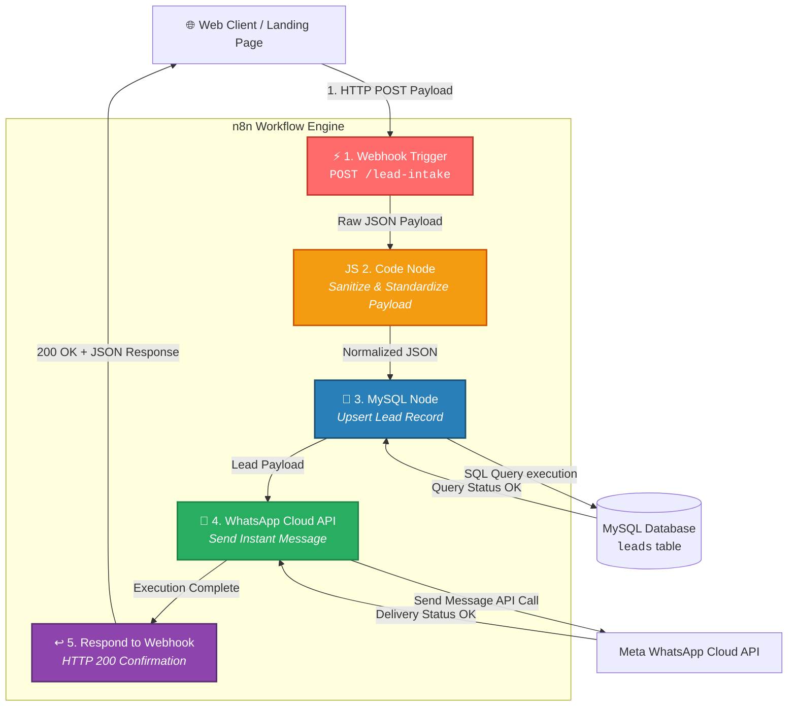

```mermaid
flowchart TD
    %% Node Styling
    classDef trigger fill:#FF6B6B,stroke:#C0392B,stroke-width:2px,color:#FFF;
    classDef code fill:#F39C12,stroke:#D35400,stroke-width:2px,color:#FFF;
    classDef db fill:#2980B9,stroke:#1B4F72,stroke-width:2px,color:#FFF;
    classDef api fill:#27AE60,stroke:#1E8449,stroke-width:2px,color:#FFF;
    classDef response fill:#8E44AD,stroke:#5B2C6F,stroke-width:2px,color:#FFF;

    Client[🌐 Web Client / Landing Page]
    
    subgraph n8n_Engine["n8n Workflow Engine"]
        Webhook["⚡ 1. Webhook Trigger<br/><code>POST /lead-intake</code>"]:::trigger
        JSCode["JS 2. Code Node<br/><i>Sanitize & Standardize Payload</i>"]:::code
        MySQL["🐬 3. MySQL Node<br/><i>Upsert Lead Record</i>"]:::db
        WhatsApp["💬 4. WhatsApp Cloud API<br/><i>Send Instant Message</i>"]:::api
        Respond["↩️ 5. Respond to Webhook<br/><i>HTTP 200 Confirmation</i>"]:::response
    end

    DB[(MySQL Database<br/><code>leads</code> table)]
    MetaAPI[Meta WhatsApp Cloud API]

    %% Data Flow Connections
    Client -->|1. HTTP POST Payload| Webhook
    Webhook -->|Raw JSON Payload| JSCode
    JSCode -->|Normalized JSON| MySQL
    MySQL -->|SQL Query execution| DB
    DB -->|Query Status OK| MySQL
    MySQL -->|Lead Payload| WhatsApp
    WhatsApp -->|Send Message API Call| MetaAPI
    MetaAPI -->|Delivery Status OK| WhatsApp
    WhatsApp -->|Execution Complete| Respond
    Respond -->|200 OK + JSON Response| Client
```
